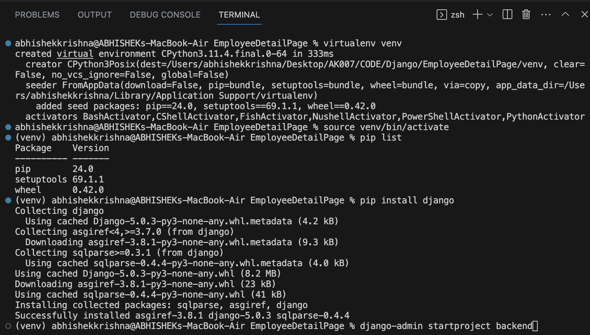
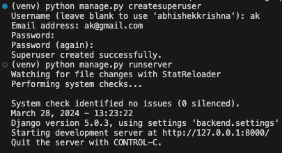

## Installation for Backend - Django
- 
## Django Commands
### Create New App
- python manage.py startapp <app_name>
### Create Super User (CREATE ADMIN USER)
- python manage.py createsuperuser
- 
- http://127.0.0.1:8000/admin/
### Changing Password
- python manage.py changepassword <your_user_name>
## ABOUT Settings.py
- BASE_DIR - dynamically get the root directory
- DEBUG = True - in production server we make it false only for dev server
- ALLOWED_HOSTS - white list domain name and ips
- TEMPLATES  - helps to render frontend templates
- WSGI_APPLICATION - server config
- DATABASES - we can change our db here
- AUTH_PASSWORD_VALIDATORS - builtin pwd validator
- USE_I18N = allow multiple lang
- STATIC_URL

## DB Schema
- https://drawsql.app/teams/cypherak/diagrams/employee-list

## Django REST Framework
- https://www.django-rest-framework.org/#installation

## Redux
- npm install redux react-redux 
- npm install @reduxjs/toolkit

## Router
- npm install react-router-dom

## Errors 
- Django: OperationalError No Such Table =>  python manage.py migrate